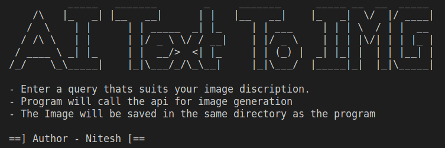
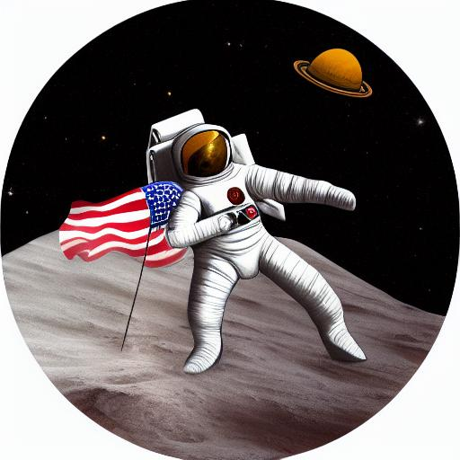
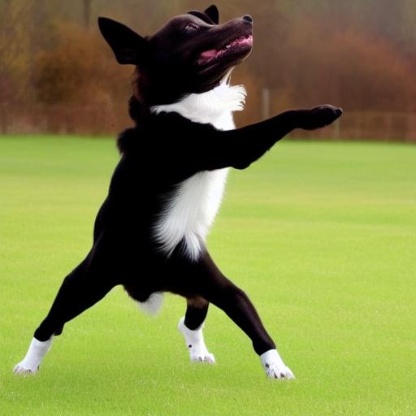

# AI Text to Image Generator

## Introduction
This C++ program is an AI Text to Image generator that utilizes the Hugging Face API to generate images based on text queries. It allows you to describe an image in text, and the program will generate an image based on your description.



## Prerequisites
Before using the AI Text to Image Generator, you'll need the following:

- C++ Compiler
- libcurl Library
- Authorization Token from Hugging Face API

## Getting Started
1. Clone this repository to your local machine.
2. Make sure to replace `"HUGGING_FACE_AUTH_KEY"` with your own Hugging Face API Authorization Token in the `main.cpp` file.
3. Compile the program using your C++ compiler.

```bash
g++ -o text_to_image_generator main.cpp request.cpp -lcurl
```

4. Run the compiled program.

```bash
./text_to_image_generator
```

5. Follow the on-screen instructions to enter a query that describes the image you want to generate.
6. The program will call the Hugging Face API for image generation.
7. The generated image will be saved in the same directory as the program with a filename corresponding to your query (e.g., "sunset_on_the_beach.jpg").

## Example Usage
Here's an example of how to use the AI Text to Image Generator:

1. Run the program.

```bash
./text_to_image_generator
```

2. Enter a query that describes the image you want to generate. For example:

```bash
Astronaut riding a horse on the moon
```

3. The program will generate the image based on your query and save it as "astronaut_riding_a_horse_on_the_moon.jpg" in the same directory.


Some example images generated are as follows...

1. Query : "Astronaut riding a horse on the moon"
<br>Image :<br>


2. Query : "A Dancing dog"
<br>Image :<br>



## Acknowledgments
- This program uses the Hugging Face API for image generation.

Feel free to modify and enhance this program for your specific needs. Happy image generation!
